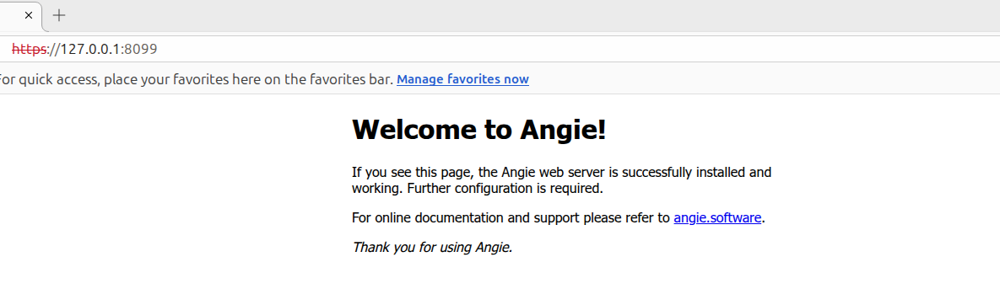

# angie-docker

## 快速开始

1. 构建镜像

* 构建支持template的镜像

```shell
docker buildx build -t angie:ntls-template-alpine -f Dockerfile-template .
```

* 构建镜像

```shell
docker buildx build -t angie:ntls-alpine -f Dockerfile .
```

2. 运行容器

```shell
docker run --rm --name angie-ntls -p 8089:80 -v http.d:/etc/angie/http.d -v stream.d:/etc/angie/stream.d angie:ntls-alpine 
```

3. 验证NTLS支持

```text
angie -V
Angie version: Angie/1.12.1
nginx version: nginx/1.31.2
built on Fri, 28 Aug 2026 05:26:45 GMT
built by gcc 14.2.0 (Alpine 14.2.0)
built with OpenSSL 3.0.3 3 May 2022
TLS SNI support enabled
configure arguments: --prefix=/etc/angie --conf-path=/etc/angie/angie.conf --error-log-path=/var/log/angie/error.log 
--http-log-path=/var/log/angie/access.log --lock-path=/run/angie.lock --modules-path=/usr/lib/angie/modules 
--pid-path=/run/angie.pid --sbin-path=/usr/sbin/angie --http-acme-client-path=/var/lib/angie/acme 
--http-client-body-temp-path=/var/cache/angie/client_temp --http-fastcgi-temp-path=/var/cache/angie/fastcgi_temp 
--http-proxy-temp-path=/var/cache/angie/proxy_temp --http-scgi-temp-path=/var/cache/angie/scgi_temp 
--http-uwsgi-temp-path=/var/cache/angie/uwsgi_temp --user=angie --group=angie --with-file-aio --with-http_acme_module 
--with-http_addition_module --with-http_auth_request_module --with-http_dav_module --with-http_flv_module 
--with-http_gunzip_module --with-http_gzip_static_module --with-http_mp4_module --with-http_random_index_module 
--with-http_realip_module --with-http_secure_link_module --with-http_slice_module --with-http_ssl_module 
--with-http_stub_status_module --with-http_sub_module --with-http_v2_module --with-http_v3_module --with-mail 
--with-mail_ssl_module --with-stream --with-stream_acme_module --with-stream_mqtt_preread_module 
--with-stream_rdp_preread_module --with-stream_realip_module --with-stream_ssl_module --with-stream_ssl_preread_module 
--with-threads --with-ld-opt='-Wl,--as-needed,-O1,--sort-common -Wl,-z,pack-relative-relocs' 
--with-openssl=../tongsuo-8.4.0 --with-openssl-opt=enable-ntls --with-ntls --add-dynamic-module=../ngx_brotli 
--add-dynamic-module=../headers-more-nginx-module --add-dynamic-module=../echo-nginx-module 
--add-dynamic-module=../ngx_http_substitutions_filter_module --add-dynamic-module=../ngx_cache_purge 
--add-dynamic-module=../nginx-dav-ext-module --add-dynamic-module=../ngx_devel_kit 
--add-dynamic-module=../set-misc-nginx-module
```





## ssl-gm.conf 参考

```shell
# /etc/angie/http.d/ssl-gm.conf

server {
    # 监听 8099 端口并开启 SSL                                                                                               
    listen 8099 ssl;                                                                                                         
    server_name localhost;
    # 1. 启用 NTLS (国密协议)                                                                                                
    ssl_ntls on;

    # 2. 配置国密算法证书 (签名证书与加密证书分离) 请确保将实际的证书文件放在对应路径下
    ssl_certificate     /etc/angie/certs/gm/server_sign.crt /etc/angie/certs/gm/server_enc.crt; 
    ssl_certificate_key /etc/angie/certs/gm/server_sign.key /etc/angie/certs/gm/server_enc.key;

    # 3. 配置标准 RSA 算法证书
    # 用于不支持国密算法的国际主流浏览器 (如 Chrome, Edge, Firefox)
    ssl_certificate     /etc/angie/certs/rsa/hserver.crt;
    ssl_certificate_key /etc/angie/certs/rsa/hserver.key;

    # 4. 配置加密套件与协议
    # 确保包含国密套件，同时兼容标准 TLS 套件
    ssl_ciphers ECC-SM2-SM4-CBC-SM3:ECDHE-SM2-WITH-SM4-SM3:ECDHE-RSA-AES128-GCM-SHA256:ECDHE-RSA-AES256-GCM-SHA384:ECDHE-RSA-AES128-SHA256:AES128-GCM-SHA256:AES256-GCM-SHA384:!aNULL:!eNULL:!RC4:!DES:!3DES:!MD5:!DSS:!PKS;
    ssl_protocols TLSv1 TLSv1.1 TLSv1.2 TLSv1.3;
    ssl_prefer_server_ciphers on;

    # 5. 默认首页配置 (使用 Angie 默认的 index.html)
    location / {
        root /usr/share/angie/html;
        index index.html index.htm;
    }
}
```